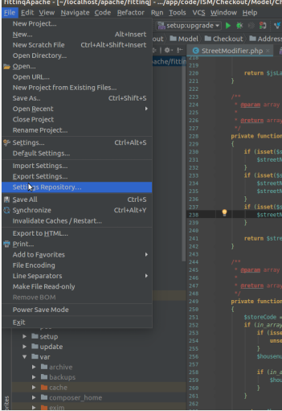
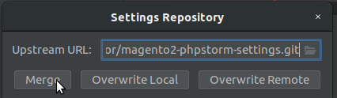

# DNA Magento 2 PhpStorm code styles repository

## Purpose

Synchronise PhpStorm code style settings and others configs between teams

## How to

* Open PhpStorm and go to File -> Settings repository


    


* Paste there ```git@bitbucket.org:ismecompany/magento2-phpstorm-settings.git```
And click a 'Merge' button.

    (In very rare cases it will fail, - use 'Overwrite local' then. Your customizations can be lost)

    

* **Done!**